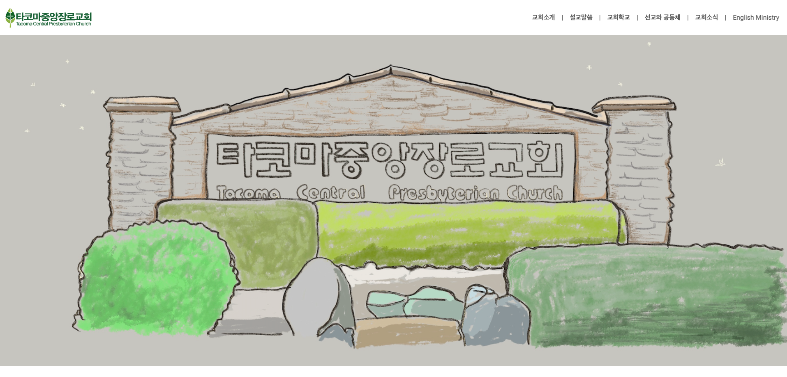
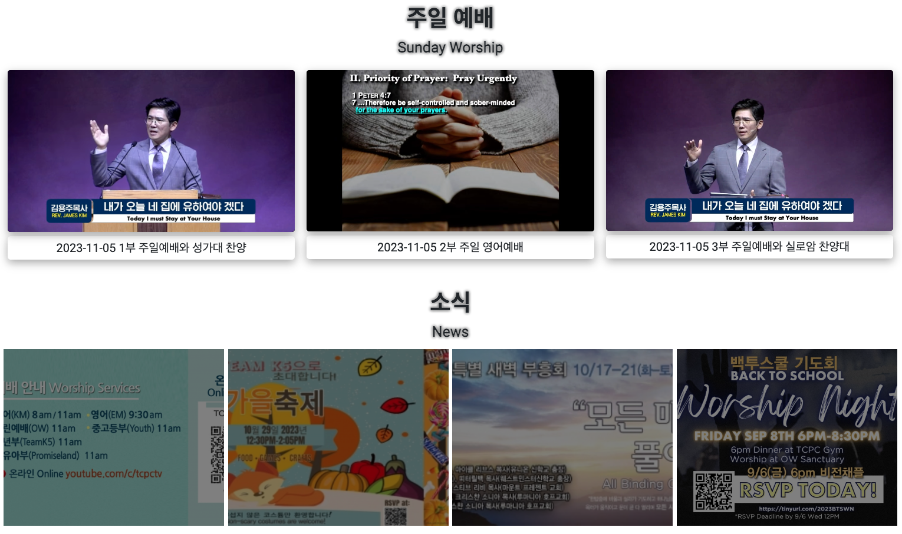
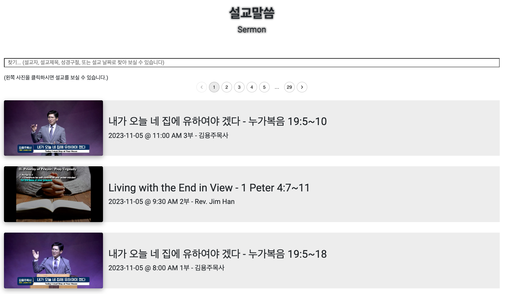

# ITCPC Church Home

Welcome to ITCPC Church Homepage!  ITCPC Church Home offers a dynamic web application designed to facilitate seamless communication within the church community. Through this platform, members and non-members alike can access a wealth of resources, including Sermons, Events, Photos, and more.

The application is meticulously crafted using the powerful MERN stack, incorporating MongoDB for robust data storage, ExpressJS for a streamlined backend, React and NextJS for an intuitive user interface, and NodeJS to ensure optimal server-side functionality. To enhance accessibility, the application is deployed on Netlify for the client-side and Heroku for the server-side, ensuring a smooth and reliable user experience for all.

# Deployment
- Frontend deployed on [Netlify](https://itcpc.netlify.app/)
- Backend deployed on [Heroku](https://itcpc-server-79e06bc6dbc6.herokuapp.com)
- Backend [Github](https://github.com/jaylee1021/itcpc-server)

# Built with

# **Preview Screen**
## Home

## Worship & News

## Sermons

## Gallery

## Board

# Features in progress
- Feature to change themes with click of a button.
- Feature to change language between Korean and English.
- Dark mode feature.
- ~~Responsive design for mobile and tablet.~~
- ~~Admin page to upload multiple photos at once to Cloudinary.~~
- Feature to add events to Google Calendar.
